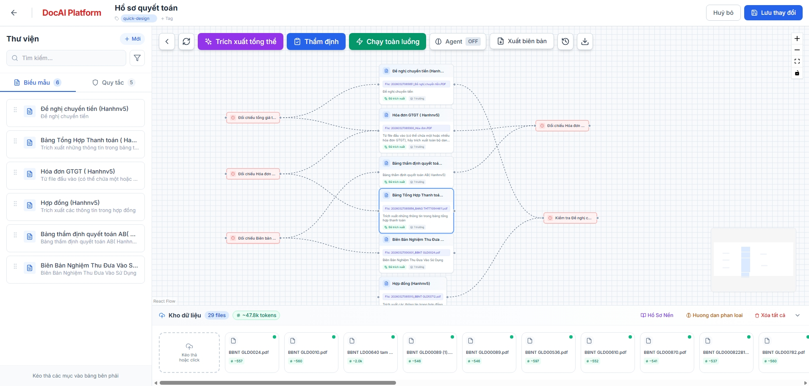
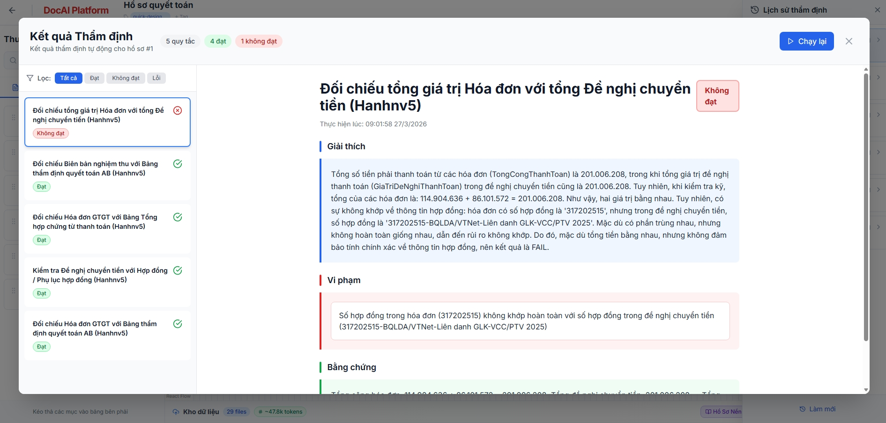
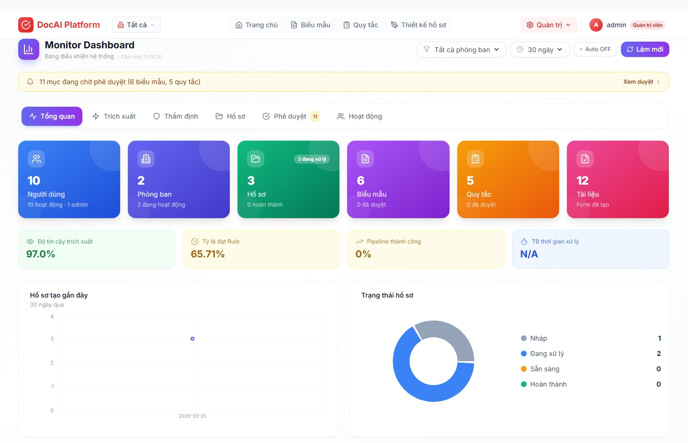
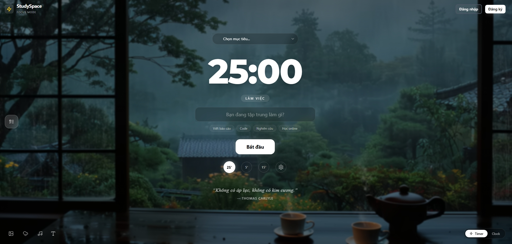

  <h1>Hi there, I'm Nguyễn Đình Dương 👋</h1>
  <h3>Data Engineer | AI Engineer | Full-Stack Developer</h3>
  
  

    I am a passionate engineer specializing in Data Engineering, AI Systems (RAG, Document Processing), and Full-Stack Development. I enjoy building scalable architectures and intelligent document processing platforms.
  

  

    
    
    
    
    
  

 

## 🛠️ Tech Stack & Skills

### Data Engineering & AI

### Full-Stack Web Development

> *Note: Alongside building core AI and Data platforms, I routinely take on freelance and outsourced Full-Stack web projects, bringing high-quality engineering rigor to client applications.*

 

## 🚀 Featured Work

### 🏢 Viettel Group Key Initiatives *(Internal / Private)*
*Due to strict confidentiality, source codes are private. These projects form the core of my architectural contributions at Viettel Network.*

* **[DocAI Platform](#)**: A flagship, **key strategic project for Viettel Group**, actively applied to automate operations across the administrative block of Viettel Network. This no-code Document AI platform automates document processing, data extraction, and business rule validation.
      
* **[DocProcess Engine](#)**: An event-driven, massively scalable document processing engine. Decoupled using Redis queues and orchestrated via Dagster. **Reduced data processing time by up to 90%** and reliably serves as the unified processing core.
* **[Data Masking Extension](#)**: A robust security platform leveraging the ICAP protocol and localized OCR (DeepSeek/Surya) to intercept network traffic and automatically redact sensitive corporate information on the fly.

### 🌐 Notable Open Source & Academic Projects
* **[StudySpace](https://github.com/duongnguyen291/StudySpace)** - A full-stack Next.js and FastAPI environment architected as a comprehensive personal learning platform featuring pomodoro tools, AI chat integration, and an intelligent quiz system.
    
* **[Teacher Assistant](https://github.com/duongnguyen291/teacher-assistant)** - An AI-powered educational platform utilizing **Docling** for intelligent document parsing, **Qdrant** for Vector Search RAG, and integrated with DeepSeek and Google Gemini for real-time pedagogical chat context generation.
* **[Fake News Detection](https://github.com/duongnguyen291/Fake_News_Detection)** - Machine Learning Capstone project utilizing state-of-the-art Transformer models (BERT, RoBERTa, DeBERTa, XLNet) to detect fake news, served via a FastAPI backend.
* **[Sign Language Recognition](https://github.com/duongnguyen291/Sign-Language-Recognition)** - A Computer Vision application comparing Convolutional Neural Networks (CNN) and Random Forest Classifier strategies to recognize sign language directly from live video streams. 
* **[System Analysis & Design (E-Commerce)](https://github.com/duongnguyen291/ISD.ICT.20242-01)** - Applied requirements engineering, UML diagramming, and business process modeling to design the architecture and operations of a robust E-Commerce environment.

 

## 🏆 Awards & Honors
- **Top 1 Student Creative Ideas Challenge** - SOICT Hackathon Finals *(School of Information and Communication Technology, HUST)*
- **Viettel Digital Talent Program 2025** - Graduated Phase 1 (Data Engineering) & Phase 2
- **HUST Academic Excellence Scholarship** - Awarded consistently across multiple semesters.

 

---
## 📊 GitHub Stats

 
 

